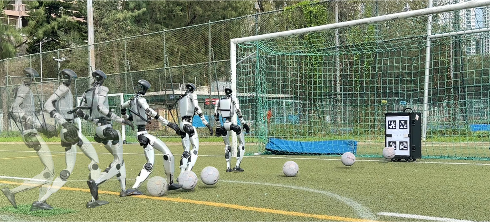

<div align="center">

# RoboNaldo

**Accurate, stable, and powerful humanoid soccer shooting via motion-guided curriculum reinforcement learning.**

<p>
  <a href="https://arxiv.org/abs/2606.11092"></a>
  <a href="https://opendrivelab.com/RoboNaldo/"></a>
  <a href="https://github.com/OpenDriveLab/RoboNaldo_Deploy/tree/f60f24459aaabc3aea9187a2b13f8923049b629c"></a>
</p>

<p>
  <a href="README.md">🌎English</a> | 🇨🇳中文
</p>

</div>

<p align="center">
  
</p>

RoboNaldo 在 Isaac Lab 中训练 Unitree G1 足球射门策略。

本仓库包含仿真训练代码。真实机器人硬件部署时，请先将训练好的策略导出为 ONNX，再配合
[Deploy Repo](https://github.com/OpenDriveLab/RoboNaldo_Deploy/tree/f60f24459aaabc3aea9187a2b13f8923049b629c) 使用。

## 仓库结构

- `source/whole_body_tracking/`：Isaac Lab extension、G1 机器人配置、tracking task、reward、observation、command 和 PPO 配置。
- `source/whole_body_tracking/whole_body_tracking/tasks/tracking/yaml/`：公开的右脚任务 preset。
- `scripts/rsl_rl/`：训练、播放和评估入口。
- `docs/`：详细的安装、任务参数和 reward 参考文档。

## 新闻

- `2026-06` 训练和部署代码发布。

## 快速开始

### 1. 安装 Isaac Lab

请先安装 Isaac Sim 和 Isaac Lab。本代码库遵循 Isaac Lab extension 布局，需要在 Isaac Lab Python 环境中运行。

推荐基线版本：

| 依赖 | 版本 |
| --- | --- |
| Isaac Sim | 4.5.0 |
| Isaac Lab | 2.1.0 |
| Python | 3.10 |

### 2. 安装 BeyondMimic

请在同一个 Isaac Lab Python 环境中安装上游
[BeyondMimic repository](https://github.com/HybridRobotics/whole_body_tracking)
以及 RoboNaldo extension：

```bash
git clone https://github.com/HybridRobotics/whole_body_tracking.git
cd whole_body_tracking
python -m pip install -e .
cd ..
python -m pip install -e source/whole_body_tracking
```

### 3. 下载机器人资产

Unitree G1 描述文件不随本仓库提交。创建环境前，请从 BeyondMimic 使用的同一资产来源下载：

```bash
mkdir -p source/whole_body_tracking/whole_body_tracking/assets
curl -L -o unitree_description.tar.gz https://storage.googleapis.com/qiayuanl_robot_descriptions/unitree_description.tar.gz
tar -xzf unitree_description.tar.gz -C source/whole_body_tracking/whole_body_tracking/assets/
rm unitree_description.tar.gz
# testing
test -f source/whole_body_tracking/whole_body_tracking/assets/unitree_description/urdf/g1/main.urdf
```

代码会通过 `whole_body_tracking/assets.py` 解析该路径，其中 `ASSET_DIR` 指向 `source/whole_body_tracking/whole_body_tracking/assets`。
不要添加 `assets/__init__.py`；不同于上游 BeyondMimic 的设置方式，本仓库已经提供拥有 `ASSET_DIR` 的 Python module。

下载后的 `source/.../assets/` 目录已被 `.gitignore` 忽略，不应提交。足球使用 Isaac Lab 原生 `SphereCfg` 创建，因此不需要额外的球体 mesh。

### 4. 准备动作和 checkpoint

训练需要一个 RoboNaldo NPZ 格式的重定向踢球动作。本仓库包含由 GVHMR+GMR 重定向得到的开源右脚踢球参考 CSV：

```text
motions/right_kick_reference.csv
```

当然，你也可以替换成自己的动作。

将仓库中的参考 CSV 转换为 NPZ：

```bash
python scripts/csv_to_npz.py \
  --input_file motions/right_kick_reference.csv \
  --input_fps 50 \
  --output_name right_kick \
  --headless
```

可选：将转换后的 NPZ 上传到 W&B registry：

```bash
python scripts/upload_npz.py \
  --artifact_path motions/right_kick.npz \
  --entity <entity> \
  --name right_kick
```

## 训练

RoboNaldo 使用分阶段课程训练。每个阶段都从上一阶段 checkpoint 继续训练。

| 阶段 | 目的 | 右脚 preset |
| --- | --- | --- |
| Stage 1a | 平地动作跟踪先验，无任务奖励 | `right_kick/tracking_params.yaml` |
| Stage 1b，可选 | mixed-terrain tracking 鲁棒性微调 | `right_kick/tracking_mixed_params.yaml` |
| Stage 2a | 小范围静态球适应 | `right_kick/task_params_1.yaml` |
| Stage 2b | 更大范围的静止球射门 | `right_kick/task_params_2.yaml` |
| Stage 3 | 动态来球射门，包含 jump trigger / adaptive sampling | `right_kick/task_params_3.yaml` |

训练时直接使用 `scripts/rsl_rl/train.py`：

```bash
python scripts/rsl_rl/train.py \
  --task Tracking-Body-Frame-Flat-G1-v0 \
  --motion_file motions/right_kick.npz \
  --yaml right_kick/tracking_params.yaml \
  --headless \
  --logger wandb \
  --log_project_name kick \
  --run_name right_kick_tracking
```

不同阶段训练时，修改 `--yaml` 参数即可切换到对应阶段 preset。

恢复训练：

```bash
python scripts/rsl_rl/train.py \
  --task Tracking-Body-Frame-Flat-G1-v0 \
  --motion_file motions/right_kick.npz \
  --yaml <yaml_file> \
  --resume True \
  --load_run <plane_tracking_run_folder> \
  --checkpoint model_<iter>.pt \
  --headless
```

> 建议 Stage 2 和 Stage 3 的 resume run 使用较小的策略噪声标准差，避免过强探索破坏已经学到的踢球先验。

> 当前 release 提供右脚 preset 和右脚参考动作。左脚课程应使用镜像后的动作数据，并将 `main_foot_name` 改为 `left_ankle_roll_link`。

论文风格的 body-frame observation 设置请使用 `Tracking-Body-Frame-Flat-G1-v0` registry；external-mocap 风格的 global observation 设置请使用 `Tracking-Flat-G1-v0`。

## 播放和评估

使用 `scripts/rsl_rl/play.py` 播放策略。已知的 Stage-2 hot-test run：

```bash
python scripts/rsl_rl/play.py \
  --task Tracking-Body-Frame-Flat-G1-v0 \
  --wandb_path <your_checkpoint_path> \
  --yaml right_kick/task_params_2.yaml \
  --motion_file motions/right_kick.npz \
  --num_envs 1 \
  --headless
```

使用 `scripts/rsl_rl/eval.py` 评估：

```bash
python scripts/rsl_rl/eval.py \
  --task Tracking-Body-Frame-Flat-G1-v0 \
  --wandb_path <your_checkpoint_path> \
  --yaml <your_yaml_file> \
  --motion_file motions/right_kick.npz \
  --num_envs 6000 \
  --headless
```

`eval.py` 会将逐 episode 射门指标以及聚合后的精度/速度摘要写入 `logs/rsl_rl/eval/`。

## 部署（ONNX 导出）

真实机器人部署需要使用本仓库导出的 ONNX 策略。导出器会写出 `policy-obs.onnx`，并内嵌
关节名称、PD 增益、默认姿态、观测/动作布局以及 motion anchor 等元数据，供
[RoboNaldo_Deploy](https://github.com/OpenDriveLab/RoboNaldo_Deploy/tree/f60f24459aaabc3aea9187a2b13f8923049b629c) 使用。

| 时机 | 输出 |
| --- | --- |
| W&B 训练（`--logger wandb`） | 每次保存 `model_*.pt` 时，在同目录生成 `<run_folder>/<run_name>.onnx` |
| `play.py` 播放 | `<checkpoint_folder>/exported/policy-obs.onnx` |

对准备部署的 checkpoint 运行一次 `play.py`（使用与训练相同的 `--task`、`--yaml` 和 `--motion_file`）即可生成 ONNX artifact。

## 文档

- [Quickstart](docs/quickstart.md)
- [Task Parameters](docs/task_params.md)
- [Rewards](docs/rewards.md)

## 引用

如果 RoboNaldo 对你的研究有帮助，请考虑引用：

```bibtex
@article{robonaldo2026,
  title={RoboNaldo: Accurate, stable, and powerful humanoid soccer shooting via motion-guided curriculum reinforcement learning},
  author={OpenDriveLab},
  journal={arXiv preprint arXiv:2606.11092},
  year={2026},
  url={https://arxiv.org/abs/2606.11092}
}
```

## 致谢

本仓库基于 [Isaac Lab (IsaacLab)](https://github.com/isaac-sim/IsaacLab)、[BeyondMimic](https://github.com/HybridRobotics/whole_body_tracking) 和 [RSL-RL](https://github.com/leggedrobotics/rsl_rl) 构建。
